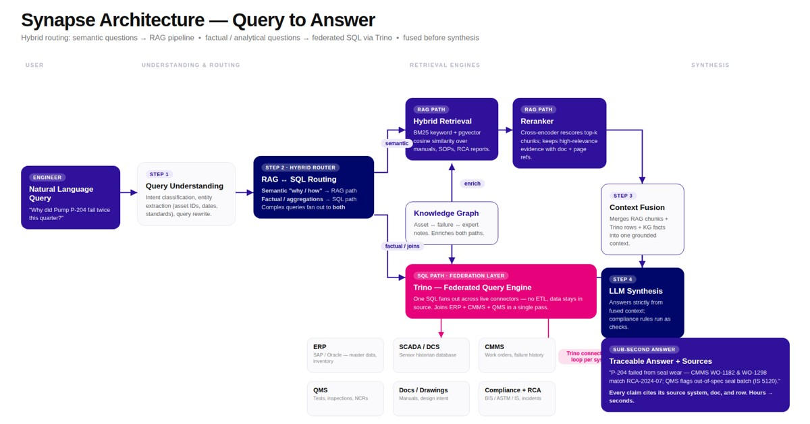

# 🧠 Synapse

## AI-powered industrial knowledge intelligence for steel operations

Synapse is a unified asset and operations brain for industrial plants. It connects structured operational data, live-style telemetry records, quality and compliance information, maintenance history, documents, and expert knowledge so teams can ask one question and receive an evidence-backed answer.

> Built for the ET AI Hackathon 2026 — Problem Statement 8: **AI for Industrial Knowledge Intelligence: Unified Asset & Operations Brain**.

## 1. Problem statement

Industrial operations are information-rich but decision-poor. The facts needed to answer a single production, maintenance, quality, or compliance question are distributed across systems that were designed to operate independently: ERP, CMMS, SCADA/DCS, QMS, document repositories, standards registers, and RCA archives [R1][R2]. These systems use different identifiers, data shapes, timestamps, and vocabularies, so the problem is not simply search; it is the absence of a shared operational context [R3].

As a result, a shift engineer investigating a recurring failure may need to manually combine an equipment history, sensor event, work order, operating procedure, previous RCA, affected coils, quality tests, and the applicable standard. The work is slow, difficult to audit, and dependent on the experience of the person who knows where each fact is stored [R4][R5].

### The core question

> **How can an industrial team turn fragmented plant data and institutional knowledge into a real-time, traceable decision-support layer without replacing the source systems or allowing an AI model to invent facts or take unapproved actions?** [R1][R6]

### Why existing approaches are insufficient

| Approach | Limitation in an industrial setting | Synapse response |
| --- | --- | --- |
| Search over documents | Finds relevant text but cannot reliably join it to current equipment, quality, or production facts [R7] | Combines semantic retrieval with structured and graph retrieval [R8] |
| Dashboard-only reporting | Shows known metrics but usually does not explain relationships, causes, or the next investigation step [R2] | Adds graph traversals and answer synthesis [R9] |
| Direct LLM question answering | Can produce fluent but unsupported numbers, citations, or operational recommendations [R6] | Grounds claims in retrieved records and exposes sources [R10] |
| A single data warehouse | Requires expensive, disruptive ETL and can lag behind operational systems [R11] | Federates source-shaped data through a lightweight read-only query layer [R12] |

## 2. Real-time operational scenarios

These scenarios demonstrate why the problem is operationally urgent. “Real-time” here means decision support during an active shift or investigation, using the latest available source records; it does not imply that Synapse directly controls plant machinery [R13].

### Scenario A — Recurring equipment failure during a shift

An engineer asks: **“Why has Pump P-204 failed twice this quarter, and what should the next shift check?”**

The answer requires more than a maintenance log: failure events and timestamps from CMMS/SCADA, the equipment’s neighborhood in the knowledge graph, prior RCA text, the governing maintenance procedure, and relevant manual passages [R4][R5]. Synapse identifies the equipment, routes the question to graph and document retrieval, correlates the returned evidence, and produces a concise answer with source references and explicit uncertainty [R8][R9][R10].

### Scenario B — Quality deviation linked to production conditions

QA asks: **“Which coils failed specification last month, which raw materials were shared, and was the same equipment involved?”**

This is a cross-system join between production/ERP, QMS test and deviation data, materials, and equipment history [R1][R2]. Synapse routes the factual aggregation to federated SQL, then uses graph relationships to connect coils, materials, equipment, failures, and standards. The result is a traceable deviation-to-asset view rather than a manually assembled spreadsheet [R12][R14].

### Scenario C — Compliance investigation after a deviation

Compliance asks: **“Which deviations are linked to a failed standard, what procedure step was missed, and is there a previous RCA?”**

The response depends on relationships among deviations, coils, equipment, standards, procedures, documents, failures, and corrective actions [R3][R15]. Synapse’s compliance projections expose the linked evidence and highlight gaps such as a failure without a recorded corrective action; the system does not present an unsupported root-cause conclusion as fact [R15][R16].

### Scenario D — Knowledge transfer when an expert is unavailable

At shift change, a less-experienced technician asks: **“What should I inspect first on this unit, and what did the previous team learn?”**

Synapse retrieves the applicable SOP/manual passages, links them to the equipment and previous incident records, and can capture a departing expert’s spoken explanation for structured extraction [R7][R17]. The extracted knowledge remains a draft until reviewed, preserving human ownership of operational content [R17].

## 3. How Synapse solves the problem

Synapse uses a hybrid retrieval-and-synthesis pipeline. Each query is first understood and classified, then sent to one or more retrieval engines. The evidence is fused before an LLM writes the answer, so the model is used for interpretation and communication—not as the system of record [R8][R9][R10].



*Figure 1. Synapse query-to-answer architecture. The diagram’s federated-query concept is retained; the current implementation executes the structured federation directly in DuckDB rather than running a separate Trino service [R12][R18].*

### The three retrieval layers

| Layer | Implementation | Best for | Evidence produced |
| --- | --- | --- | --- |
| Structured federation | DuckDB with four attached, read-only source databases | Counts, filters, aggregations, and joins across ERP, SCADA, QMS, and CMMS | Query results tied to source tables and records [R12] |
| Semantic retrieval | Chroma with sentence-transformer embeddings | Manuals, SOPs, RCAs, reports, and natural-language operating knowledge | Matching document chunks and metadata such as document ID and source path [R7][R19] |
| Knowledge graph | Neo4j AuraDB | Multi-hop relationships among equipment, failures, RCAs, coils, deviations, standards, procedures, and technicians | Entity neighborhoods, relationship paths, and graph records [R3][R9] |

### Query routing

The tiered router keeps routing predictable and reduces unnecessary model calls [R8].

1. **Tier 1 — entity matching:** detect canonical IDs and known plant entities [R20].
2. **Tier 2 — deterministic intent classification:** identify structured, graph, document, or combined retrieval needs [R21].
3. **Tier 3 — LLM fallback:** resolve ambiguous natural-language intent only when deterministic routing is insufficient [R22].

### Context fusion and synthesis

The synthesizer combines structured facts, graph evidence, and document passages into a response organized as direct answer, correlation, implication, and action [R10]. Claims are source-tagged, and the confidence helper distinguishes direct evidence, corroboration, sample size, and authoritative sources [R16]. The synthesis prompt also prohibits unsupported statistics; numeric claims must come from retrieved evidence [R10].

### Safe actions and human approval

Synapse is designed for decision support, not autonomous plant control. Proposed updates use a closed action taxonomy and verify referenced entity IDs before a user sees a confirmation card [R23]. The workflow is **draft → human review → commit**, which prevents a fluent model response from silently changing a CMMS, QMS, or compliance record [R23].

## 4. Domain model and data lineage

The ontology defines the entities and valid relationships before data is loaded. Core entities include `Equipment`, `Failure`, `RCA`, `Procedure`, `Technician`, `Coil`, `QualityTest`, `Standard`, `Deviation`, `RawMaterial`, and `Document` [R3]. Relationships such as `EXPERIENCED`, `DIAGNOSED_BY`, `HAS_DEVIATION`, `TESTED_BY`, `MADE_FROM`, `FOLLOWS_PROCEDURE`, and `DOCUMENTED_IN` provide the connective tissue missing from isolated source systems [R3].

Every record is classified by provenance where applicable: real, synthetic, hybrid, or reference-derived [R3]. Plant-specific facts are kept separate from general industry explanations. An industry reference can explain why a failure mechanism is plausible, but it is not treated as proof that the mechanism occurred at this plant [R3][R9].

## 5. Product surfaces

- **Conversational operations assistant:** asks cross-system questions through `POST /api/ask` [R24].
- **RCA and failure views:** inspect failures and linked root-cause evidence [R24][R25].
- **Compliance dashboard:** review standards, deviations, linked failures, and missing corrective-action signals [R15][R24].
- **Knowledge transfer:** conduct an interview and turn expert knowledge into reviewable structured content [R17][R24].
- **Health checks:** report readiness of the API and data services through `/health` and `/healthz` [R24].

## 6. Architecture and request flow

```text
User question
    ↓
Query understanding + canonical entity matching
    ↓
Tiered hybrid router
    ├── Structured path → DuckDB federation over ERP / SCADA / QMS / CMMS
    ├── Semantic path  → Chroma document search
    └── Graph path     → Neo4j relationship traversal
    ↓
Context fusion + confidence assessment
    ↓
LLM synthesis with source-aware answer format
    ↓
Answer, sources, retrieval plan, model, latency, and optional human-approved draft action
```

The backend is a FastAPI application; the frontend is React; persistent document vectors live under the Chroma data directory; the graph is loaded through the ontology loader; and the deployment configuration runs the API with Uvicorn on Railway [R18][R19][R26][R27].

## 7. Technology stack

| Concern | Technology | Repository reference |
| --- | --- | --- |
| API | FastAPI + Pydantic | `api/main.py`, `requirements.txt` [R24][R26] |
| Structured federation | DuckDB | `retrieval/structured_store.py` [R12] |
| Semantic search | Chroma + LangChain + sentence-transformers | `embeddings/` [R7][R19] |
| Knowledge graph | Neo4j | `retrieval/graph_store.py`, `ontology/` [R3][R9] |
| LLM gateway | OpenRouter over HTTPS | `synthesizer/`, `router/tier3_fallback.py` [R10][R22] |
| Frontend | React/Vite build | `frontend/ui/` [R28] |
| Authentication | JWT, httpOnly cookies, RBAC | `api/auth.py`, `supabase/auth_schema.sql` [R29] |
| Deployment | Railway backend; Vercel frontend configuration | `railway.json`, `frontend/vercel.json` [R27][R30] |

## 8. Local development

### Prerequisites

- Python 3.11 or newer [R26]
- Node.js and pnpm for the frontend [R28]
- Access to Neo4j for graph retrieval, unless using the ontology snapshot fallback [R9]
- Environment variables based on `.env.example` [R31]

### Backend

```powershell
python -m venv .venv
.\.venv\Scripts\Activate.ps1
pip install -r requirements.txt
uvicorn api.main:app --reload
```

The API is then available at `http://localhost:8000`; health endpoints are `/health` and `/healthz` [R24].

### Frontend

```powershell
cd frontend/ui
pnpm install
pnpm dev
```

The frontend configuration and build scripts are defined in `frontend/ui/package.json` and `frontend/ui/vite.config.ts` [R28].

### Data and graph loading

Use the scripts and loaders in `scripts/`, `embeddings/`, and `ontology/` to prepare source data, ingest documents, and load the graph [R3][R19][R32]. Do not commit credentials or production exports; use `.env.example` as the configuration contract [R31].

## 9. Trust, safety, and limitations

- **Traceability:** answers return sources and retrieval metadata instead of opaque prose [R10].
- **Read-first design:** retrieval is read-only; changes require a human-approved commit path [R23].
- **Provenance awareness:** synthetic and reference-derived content is labeled in the ontology [R3].
- **No autonomous control:** Synapse does not issue direct commands to plant control systems [R13].
- **Data freshness:** “real-time” depends on source-system update frequency and ingestion state [R12][R13].
- **Latency:** LLM synthesis can dominate end-to-end response time, especially on free-tier model routes [R33].
- **Coverage:** the compliance surface and production connectors remain areas for continued hardening [R33].

## 10. Evaluation and extension

Evaluation fixtures and test helpers live under `evaluation/` and `synthesizer/test_synthesize.py` [R34]. New source systems should be mapped into the ontology and structured catalog layer, with canonical identifiers added to the router index; new actions should inherit the existing ID-verification and human-approval guardrails [R3][R12][R20][R23].

## 11. References

The references below are intentionally attached throughout the README so readers can verify both the problem framing and the implementation claims.

- **[R1]** Source-system and plant-domain definitions: `ontology/schema/relationships.json`.
- **[R2]** Compliance projections and deviation/failure relationships: `api/compliance_store.py`.
- **[R3]** Ontology entities, provenance labels, and relationship constraints: `ontology/schema/node_labels.json`, `ontology/schema/relationships.json`.
- **[R4]** Graph retrieval patterns for equipment, failures, and RCAs: `retrieval/graph_store.py`, `retrieval/patterns.py`.
- **[R5]** Structured retrieval and operational joins: `retrieval/structured_store.py`, `pipeline.py`.
- **[R6]** Synthesis and evidence-grounding rules: `synthesizer/synthesize.py`, `synthesizer/confidence.py`.
- **[R7]** Document ingestion and semantic retrieval: `embeddings/ingest.py`, `embeddings/search.py`, `embeddings/vector_store.py`.
- **[R8]** Router design and tier behavior: `router/router.py`, `router/tier1_matcher.py`, `router/tier2_classifier.py`, `router/tier3_fallback.py`.
- **[R9]** Neo4j graph access and relationship queries: `retrieval/graph_store.py`, `ontology/load_to_neo4j.py`.
- **[R10]** Answer format, source handling, and numeric-claim constraints: `pipeline.py`, `synthesizer/synthesize.py`.
- **[R11]** Federation design rationale and removal of the separate Trino service: `retrieval/structured_store.py`, `requirements.txt`.
- **[R12]** Direct DuckDB federation over ERP, SCADA, QMS, and CMMS: `retrieval/structured_store.py` and `trino/catalog/*.properties`.
- **[R13]** API boundaries and read-only operational surfaces: `api/main.py`.
- **[R14]** End-to-end retrieval pipeline output contract: `pipeline.py`.
- **[R15]** Compliance summaries, linked deviations, and corrective-action gaps: `api/compliance_store.py`.
- **[R16]** Confidence scoring and corroboration rules: `synthesizer/confidence.py`.
- **[R17]** Knowledge-transfer interview and extraction flow: `api/knowledge_transfer.py`.
- **[R18]** Architecture illustration: [`docs/synapse_architecture.jpg`](docs/synapse_architecture.jpg); deployment/runtime notes: `requirements.txt`, `railway.json`.
- **[R19]** Chroma persistence and metadata: `embeddings/vector_store.py`, `embeddings/ingest.py`.
- **[R20]** Canonical ID extraction and entity index: `router/canonical_ids.py`, `router/entity_index.py`.
- **[R21]** Rule-based intent classification: `router/tier2_classifier.py`.
- **[R22]** LLM fallback and model configuration: `router/tier3_fallback.py`, `synthesizer/config.py`.
- **[R23]** Action validation and human approval: `api/main.py`, `pipeline.py`, `api/knowledge_transfer.py`.
- **[R24]** FastAPI routes and health endpoints: `api/main.py`.
- **[R25]** RCA data surface: `api/rca_store.py`.
- **[R26]** Backend dependencies and runtime: `requirements.txt`, `Procfile`.
- **[R27]** Railway deployment configuration: `railway.json`.
- **[R28]** React/Vite frontend: `frontend/ui/package.json`, `frontend/ui/vite.config.ts`, `frontend/ui/src/`.
- **[R29]** Authentication and role model: `api/auth.py`, `supabase/auth_schema.sql`.
- **[R30]** Frontend hosting configuration: `frontend/vercel.json`.
- **[R31]** Environment-variable contract: `.env.example`.
- **[R32]** Data preparation and ingestion utilities: `scripts/`, `embeddings/`, `ontology/`.
- **[R33]** Known latency and maturity notes: project evaluation notes and current implementation behavior in `pipeline.py`, `evaluation/`.
- **[R34]** Evaluation fixtures and synthesis tests: `evaluation/`, `synthesizer/test_synthesize.py`.

## License

See [`LICENSE`](LICENSE).

---

<div align="center">

**Synapse turns fragmented industrial data into traceable operational context.**

</div>
